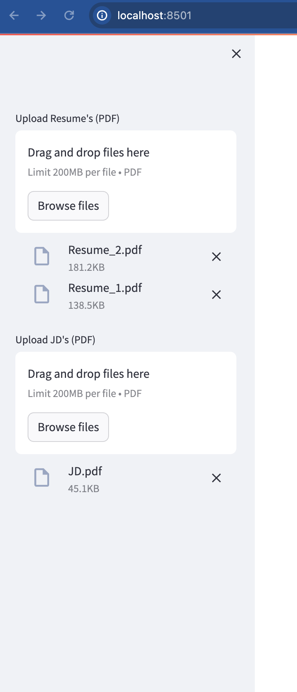
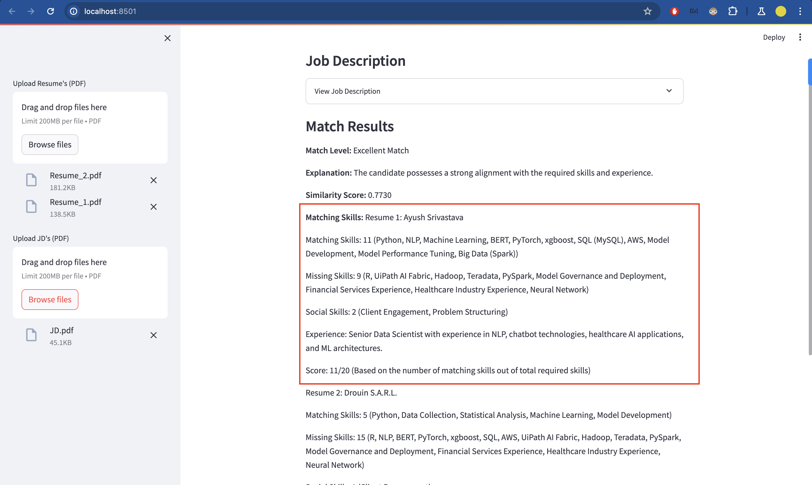
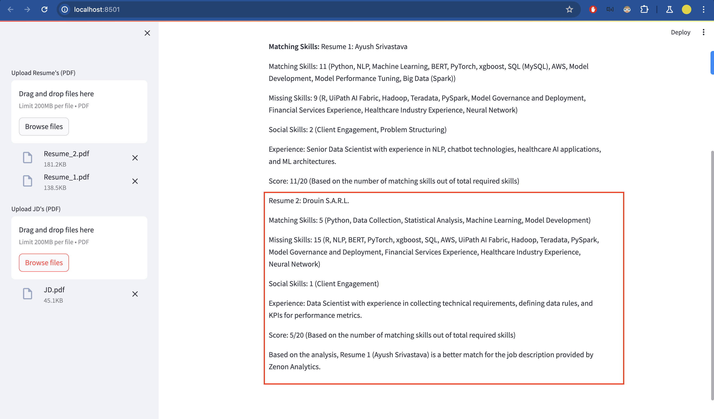

# Resume-Job Description Matcher
The objective of comparing resumes and job descriptions using Large Language Models
(LLM) and generating task descriptions with objectives is to streamline the recruitment
process and ensure optimal alignment between candidate qualifications and job requirements.
By leveraging advanced text analysis techniques, such as tokenization, embedding, similarity
analysis, and LLM Prompting the goal is to accurately assess the suitability of candidates for
specific job roles. 

# How to Run

1. Create a `.env` file and put your openai_key.
2. Create a virtual environment (Conda preferable with python version 3.12.2)
OR
3. Install virtual env `python -m pip install virtualenv`
4. Create Virtual Env `pythoon virtualenv venv`
5. Run `venv/Scripts/activate`
6. Run `pip install -r requirements.txt`
7. Run StreamLit `streamlit run app.py`


1. Data Collection:

   - The UI have the functionality to upload Resumes and Job descriptions.

Demo Images:


2. Preprocessing:
    - Cleaning and preprocessing of resume and JD text is done.
    ```python
        def preprocess_text(self, text):
            text = text.lower()  # Lowercase
            text = re.sub(r'[^\w\s]', '', text)  # Remove punctuation
            tokens = nltk.word_tokenize(text)  # Tokenize
            return tokens
    ```

3. Tokenization and Embedding:

    - Tokenization and Embedding of resume and JD text is done.
    ```python
    def get_embedding(self, text):
        response = openai.Embedding.create(
            input=text,
            engine="text-embedding-ada-002"
        )
        embedding = response['data'][0]['embedding']
        return np.array(embedding)
    ```

4. Similarity Analysis:
    - Similarity Analysis of resume and JD text is done. (Also euclidean distance is been tested.)
      ```python
      def calculate_similarity(self, embedding1, embedding2):
        similarity = np.dot(embedding1, embedding2) / (np.linalg.norm(embedding1) * np.linalg.norm(embedding2))
        return similarity
       ``` 

5. Threshold Setting:
    - Threshold is set to 0.8
    ```python
    excellent_match_threshold = 0.8
    good_match_threshold = 0.6
    fair_match_threshold = 0.4
    ```

6. Match Score and Explanation using LLM:
    - Match Score and Explanation using LLM is done.

Demo Images:




# TO-DO:

    1. Generate a CSV file containing detailed matching results.
    Include the following columns in the CSV:
    Resume: File name or identifier of the resume.
    JD: File name or identifier of the job description.
    Matching_score: Overall similarity score between the resume and job description.
    Matching_Skills: Specific skills found in both the resume and job description.
    (Optional) Additional relevant columns, such as:
    Top_Matching_Keywords
    Experience_Match
    Education_Match

    2. Make a better UI and functionality to extract keywords from Resume and JD.


